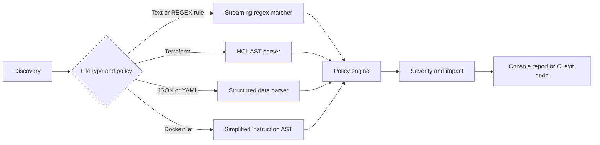

# GuardRail

[](https://github.com/binho13edu-coder/guardrail/actions/workflows/ci.yml)
[](go.mod)
[](LICENSE)

GuardRail is a fast DevSecOps CLI that catches exposed secrets and insecure infrastructure configuration before it reaches CI/CD.

[Documentation](docs/rule-authoring.md) · [Report a bug](https://github.com/binho13edu-coder/guardrail/issues/new?template=bug_report.md) · [Contribute](CONTRIBUTING.md) · [Security](SECURITY.md)

## The problem

Security checks are often added late, run slowly, and return a vague warning with no operational context. That lets secrets, public resources, and unsafe container settings reach pull requests and deployment pipelines.

## The solution

GuardRail combines streaming secret detection with policy-driven configuration analysis. It parses Terraform HCL, JSON, YAML, and Dockerfile instructions, then reports the risk and impact with CI-friendly exit codes.



## Quick start

```bash
go install github.com/binho13edu-coder/guardrail@latest
guardrail scan . --threshold high
```

Use `--threshold critical|high|medium|low|none` to control which severity fails the build. Exit code `1` means the selected threshold was met; exit code `2` means an execution or parsing error.

## What it detects

| Area | Examples |
| --- | --- |
| Secrets | AWS access keys and generic API tokens |
| Dockerfile | Root user, mutable image tags, and `ADD` |
| Terraform | Public S3 access and unencrypted EBS volumes |
| JSON/YAML | Configured public-access booleans |

```dockerfile
# Finding: the container runs with unnecessary root privileges
USER root
```

```hcl
# Finding: public S3 ACL
resource "aws_s3_bucket" "assets" {
  acl = "public-read"
}
```

## Performance

The current benchmark for mixed regex, Dockerfile, and Terraform scanning measured **2.49 ms/op**, **220 KB/op**, and **135 allocations/op** on an AMD Ryzen 5 PRO 5655GE. Measure on your own CI runner before using this as a capacity estimate:

```bash
go test -run='^$' -bench=. -benchmem ./pkg/scanner
```

## Rules

Rules are YAML files loaded from `rules/` by default. See the full [rule-authoring guide](docs/rule-authoring.md) to create regex and structured `CONFIG` policies.

## Known limitations

- Terraform policies use a real HCL AST, but currently cover the resource and attributes defined by the bundled policies only.
- Dockerfiles use a lightweight instruction AST; it is not a complete Docker build parser.
- JSON/YAML public-access rules evaluate configured boolean keys. Indirect values, templates, and provider-specific semantics may need additional policies.
- Files larger than 10 MiB skip structured parsing to bound memory use; regex scanning still runs.

## Development

```bash
go mod tidy
go vet ./...
go test -race ./...
go test -bench=. ./...
```

## GitHub Action

Add GuardRail to a workflow with configurable policies and threshold handling:

```yaml
permissions:
  contents: read
  security-events: write

steps:
  - uses: actions/checkout@v4
  - uses: binho13edu-coder/guardrail@v1
    with:
      threshold: high
      rules: rules
      upload-sarif: 'true'
```

## Roadmap

- Kubernetes manifests and Helm charts
- SARIF and Markdown reports
- Additional cloud-provider policies
- Pre-commit and GitHub Action integrations

## Contributing

Contributions are welcome. Read [CONTRIBUTING.md](CONTRIBUTING.md), start with a `good first issue`, and keep changes covered by tests.

## License

Apache-2.0. See [LICENSE](LICENSE).
